# Vue電商使用VantUI


# VantUI

https://youzan.github.io/vant/#/zh-CN/

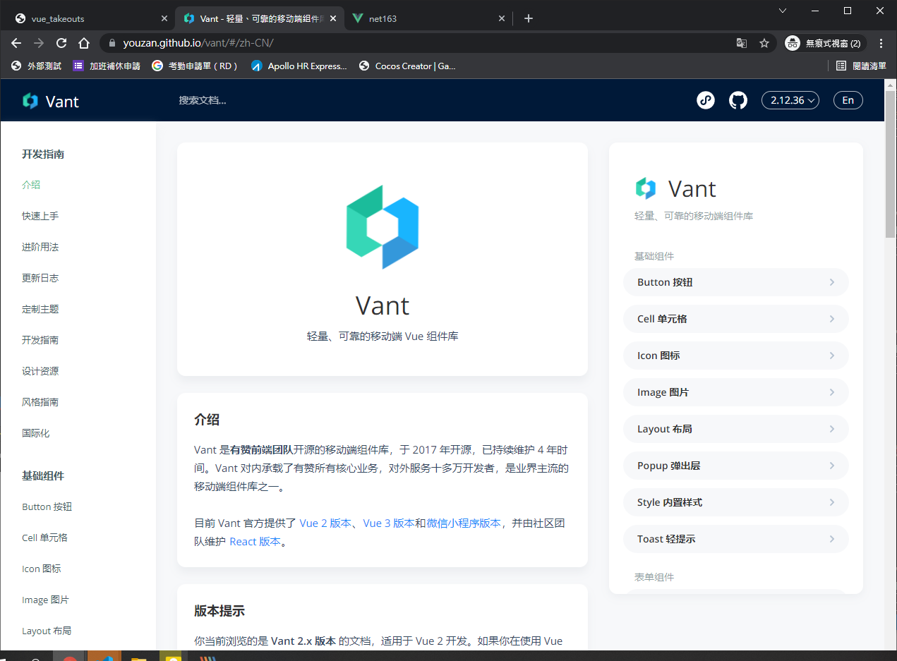

# 創建項目

創建vue2項目

```bash
vue create vue_vantui_shop
```

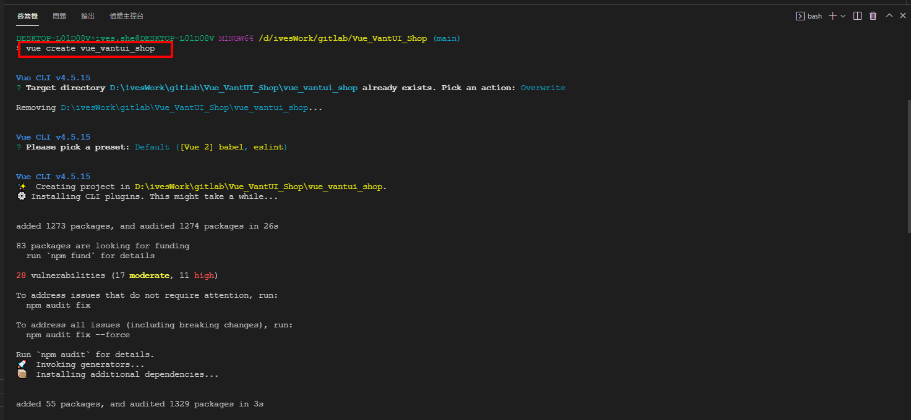

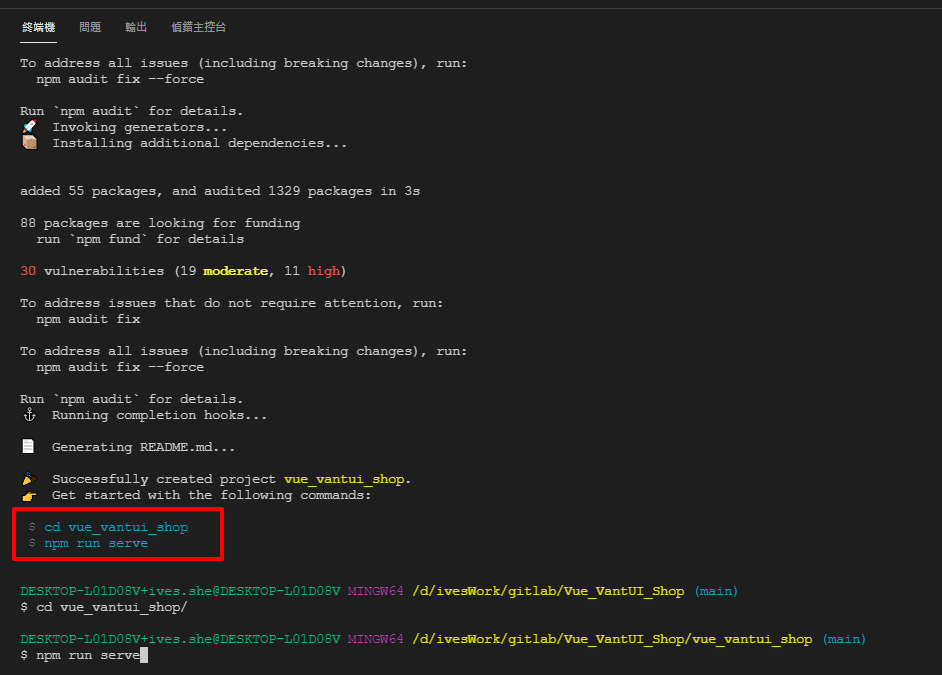


# 安裝VSCode插件

安裝 Path Intellisense

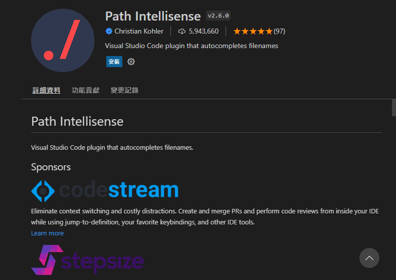

## VSCode settings.json新增設定
```bath
"path-intellisense.mappings": {
    "@": "${workspaceRoot}/src"
  },
```

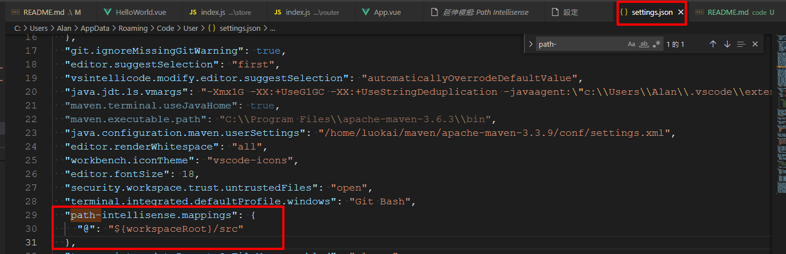

## 新建jsconfig.js

```js
{
  "compilerOptions": {
    "target": "ES6",
    "module": "commonjs",
    "allowSyntheticDefaultImports": true,
    "baseUrl": "./",
    "paths": {
      "@/*": [
        "src/*"
      ]
    }
  },
  "exclude": [
    "node_modules"
  ]
}
```

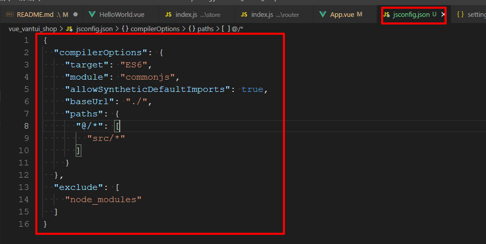

之後使用@就會有提示的功能了

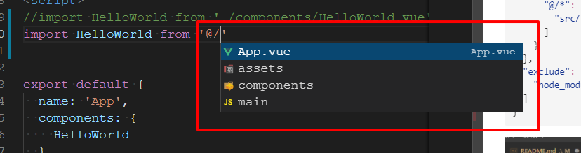

# 安裝VantUI

```bash
npm i vant -S
```

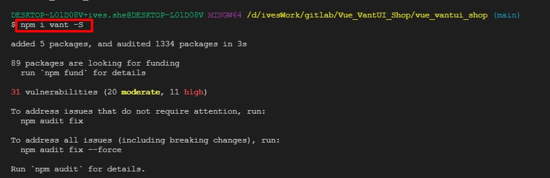

# 新增Vue Router

```bash
vue add router
```

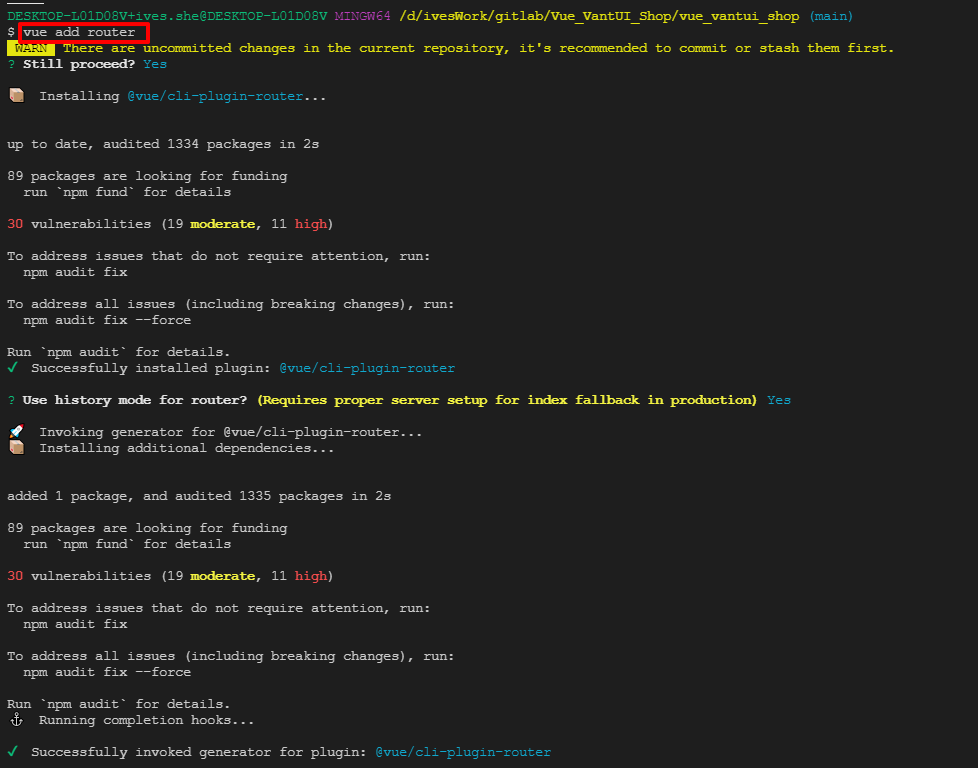

# 關閉eslint

新增vue.config.js

```js
module.exports = {
  // 關閉eslint檢查
  lintOnSave: false,
  // 配置打包時的路徑，/直接使用會出現找不到資源
  publicPath: process.env.VUE_APP_NODE_ENV === 'production' ? './' : '/',
  devServer: {
    // 瀏覽器自動打開和端口配置
    open: true,
    port: 8088
  }
}
```

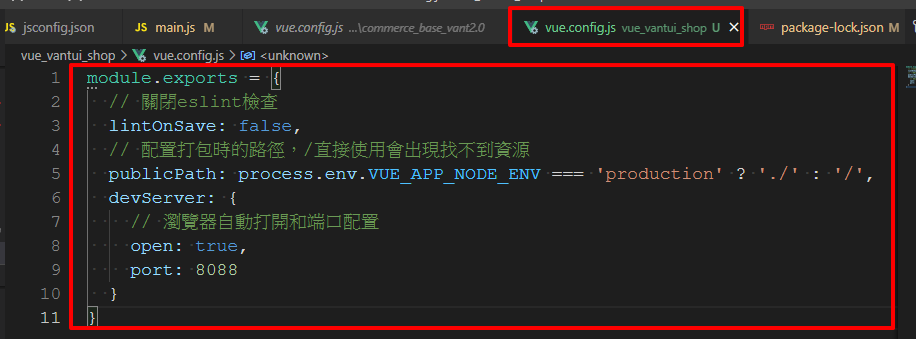

# 安裝reset-css

```bash
npm i reset-css -save
```


修改原始設定使其不會影響到html的font-size

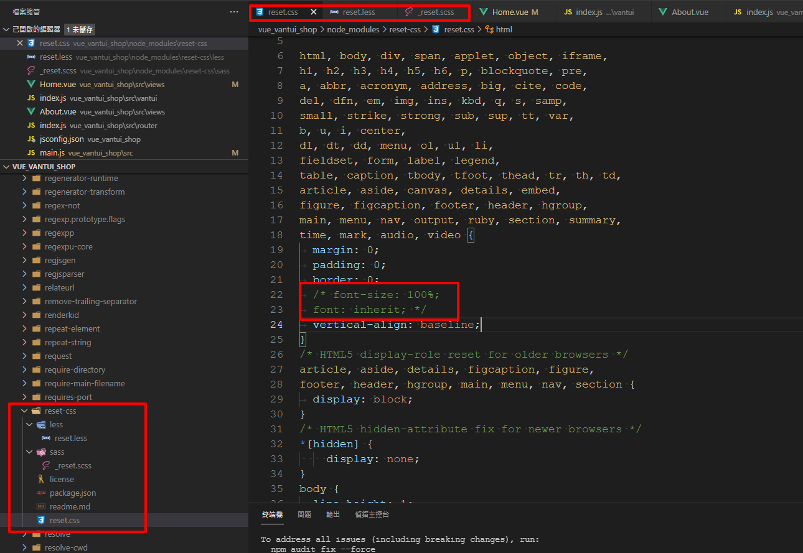

# 安裝less

```bash
npm i less @3 less-loader@5
```

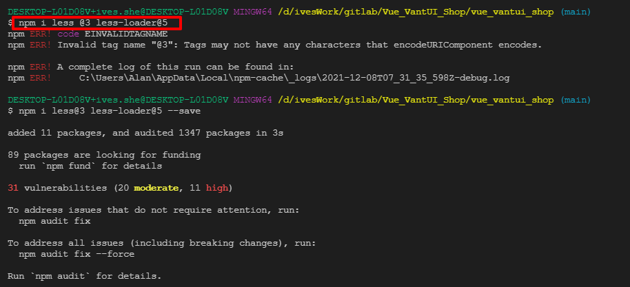

# 安裝axios

```bash
npm i axios
```

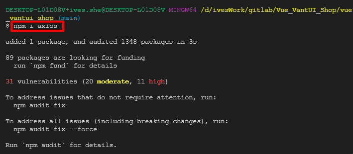

# 封裝axios

## api.js

```js
import request from './request'

// 請求首頁數據
export const GetHomeData = () => request.get('/index/index')
```

## request.js

```js
import axios from 'axios'

// 創建一個單例
const instance = axios.create({
  baseURL: 'http://kumanxuan1.f3322.net:8001',
  timeout: 5000
})

// 請求攔截
instance.interceptors.request.use(config => {
  return config
}, err => {
  return Promise.reject(err)
})

// 響應攔截
instance.interceptors.response.use(res => {
  return res.data
}, err => {
  return Promise.reject(err)
})

export default instance
```

# 完成HOME組件搜尋列、輪播圖

Home.vue

```js
<template>
  <div class="home">
    <!-- <van-button type="primary">主要按钮</van-button> -->
    <van-search
      v-model="SearchVal"
      disabled
      shape="round"
      background="#fff"
      placeholder="請輸入搜索關鍵詞"
      @click="goToPopup"
    />
    <van-swipe class="my-swipe" :autoplay="3000" indicator-color="darkred">
      <van-swipe-item v-for="item in banner" :key="item.id">
        
      </van-swipe-item>
    </van-swipe>

    <!-- <transition name="slide"> -->
    <transition name="van-slide-right">
      <router-view></router-view>
    </transition>
  </div>
</template>

<script>
import { GetHomeData } from '@/request/api'
export default {
  name: 'Home',
  data() {
    return {
      SearchVal: "",
      // 輪播圖數組
      banner: [],
    }
  },
  methods: {
    goToPopup() {
      this.$router.push('/home/popup')
    }
  },
  created() {
    // 獲取首頁數據
    GetHomeData().then(res => {
      console.log("@@@res", res)
      if (res.errno == 0) {
        // 成功獲取到准確的數據
        console.log("@@@res.data", res)
        let { banner } = res.data
        this.banner = banner
        console.log("@@@banner", banner)
      }
    }).catch(err => {
      console.log("@@@err", err)
    })
  },

  components: {

  }
}
</script>

<style lang="less" scoped>
</style>

```

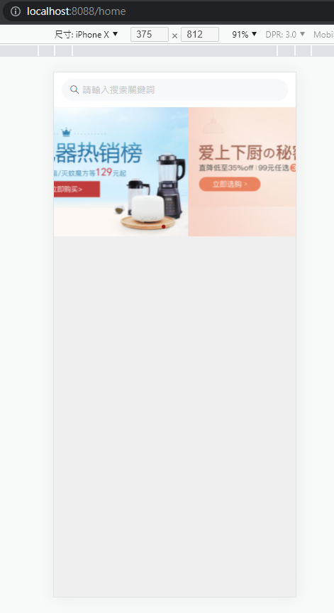
